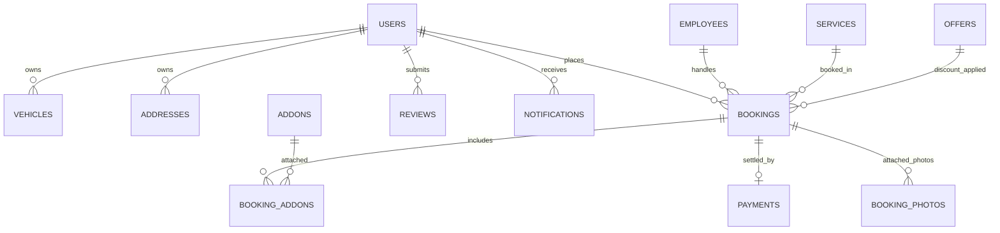

# Mobile Water Wash - Backend Implementation Plan & API Specifications

## Executive Summary
This document provides the full backend architectural design, database schemas, REST API specifications, authentication flows, role-based access controls, and frontend-to-backend integration strategies for the Mobile Water Wash / Doorstep Vehicle Washing platform.

The backend will be built with **Python 3.11+**, **FastAPI**, **MySQL**, **SQLAlchemy 2.x**, **Alembic**, and **Pydantic v2**.

---

## 1. Existing Frontend Route & Data Mapping

| Frontend Route | Role Access | Primary Components / Pages | Required Backend API Endpoints | Current Mock Data Source |
|---|---|---|---|---|
| `/login` | Public | `CustomerLogin.jsx` | `POST /api/v1/auth/login` | `MOCK_CUSTOMER_USER` |
| `/register` | Public | `CustomerRegister.jsx` | `POST /api/v1/auth/register` | `authService.register` |
| `/verify-otp` | Public | `OtpVerification.jsx` | `POST /api/v1/auth/verify-otp` | `authService.verifyOtp` |
| `/forgot-password` | Public | `ForgotPassword.jsx` | `POST /api/v1/auth/forgot-password` | `authService.forgotPassword` |
| `/employee/login` | Public | `EmployeeLogin.jsx` | `POST /api/v1/auth/login` (Role: Employee) | `MOCK_EMPLOYEE_USER` |
| `/admin/login` | Public | `AdminLogin.jsx` | `POST /api/v1/auth/login` (Role: Admin) | `MOCK_ADMIN_USER` |
| `/` | Customer | `CustomerHome.jsx` | `GET /api/v1/services`, `GET /api/v1/offers`, `GET /api/v1/notifications` | `INITIAL_SERVICES`, `INITIAL_OFFERS` |
| `/services` | Customer | `ServicesPage.jsx` | `GET /api/v1/services` | `INITIAL_SERVICES` |
| `/service/:id` | Customer | `ServiceDetailPage.jsx` | `GET /api/v1/services/{id}` | `serviceService.getServiceById` |
| `/book` | Customer | `BookingFlowPage.jsx` | `GET /api/v1/vehicles`, `GET /api/v1/addresses`, `GET /api/v1/addons`, `POST /api/v1/offers/validate`, `POST /api/v1/bookings` | `INITIAL_VEHICLES`, `INITIAL_ADDRESSES`, `ADD_ONS` |
| `/bookings` | Customer | `MyBookingsPage.jsx` | `GET /api/v1/bookings`, `PUT /api/v1/bookings/{id}/cancel`, `POST /api/v1/bookings/{id}/review` | `INITIAL_BOOKINGS` |
| `/offers` | Customer | `OffersPage.jsx` | `GET /api/v1/offers`, `GET /api/v1/offers/coupons` | `INITIAL_OFFERS`, `INITIAL_COUPONS` |
| `/profile` | Customer | `ProfilePage.jsx` | `GET /api/v1/users/me`, `PUT /api/v1/users/me` | `MOCK_CUSTOMER_USER` |
| `/my-vehicles` | Customer | `MyVehiclesPage.jsx` | `GET /api/v1/vehicles`, `POST /api/v1/vehicles`, `PUT /api/v1/vehicles/{id}`, `DELETE /api/v1/vehicles/{id}` | `INITIAL_VEHICLES` |
| `/saved-addresses` | Customer | `SavedAddressesPage.jsx` | `GET /api/v1/addresses`, `POST /api/v1/addresses`, `PUT /api/v1/addresses/{id}`, `DELETE /api/v1/addresses/{id}` | `INITIAL_ADDRESSES` |
| `/notifications` | Customer | `NotificationsPage.jsx` | `GET /api/v1/notifications`, `PUT /api/v1/notifications/{id}/read`, `PUT /api/v1/notifications/read-all` | `INITIAL_NOTIFICATIONS` |
| `/employee` | Employee | `EmployeeDashboard.jsx` | `GET /api/v1/employee/jobs`, `GET /api/v1/employee/jobs/{id}`, `PUT /api/v1/employee/jobs/{id}/accept`, `PUT /api/v1/employee/jobs/{id}/status`, `POST /api/v1/bookings/{id}/photos` | `MOCK_EMPLOYEE_USER`, `INITIAL_BOOKINGS` |
| `/employee/profile` | Employee | `EmployeeProfile.jsx` | `GET /api/v1/employee/profile`, `PUT /api/v1/employee/profile` | `MOCK_EMPLOYEE_USER` |
| `/admin` | Admin | `AdminDashboard.jsx` | `GET /api/v1/admin/dashboard`, `GET /api/v1/admin/analytics/revenue`, `GET /api/v1/admin/analytics/bookings` | `ADMIN_ANALYTICS_DATA` |
| `/admin/bookings` | Admin | `AdminBookingsPage.jsx` | `GET /api/v1/admin/bookings`, `PUT /api/v1/admin/bookings/{id}/status`, `POST /api/v1/admin/bookings/{id}/assign` | `INITIAL_BOOKINGS` |
| `/admin/customers` | Admin | `AdminCustomersPage.jsx` | `GET /api/v1/admin/customers`, `PUT /api/v1/admin/customers/{id}/status` | `INITIAL_CUSTOMERS` |
| `/admin/employees` | Admin | `AdminEmployeesPage.jsx` | `GET /api/v1/admin/employees`, `POST /api/v1/admin/employees`, `PUT /api/v1/admin/employees/{id}`, `DELETE /api/v1/admin/employees/{id}` | `INITIAL_EMPLOYEES` |
| `/admin/services` | Admin | `AdminServicesPage.jsx` | `GET /api/v1/services`, `POST /api/v1/admin/services`, `PUT /api/v1/admin/services/{id}`, `DELETE /api/v1/admin/services/{id}` | `INITIAL_SERVICES` |
| `/admin/offers` | Admin | `AdminOffersPage.jsx` | `GET /api/v1/admin/offers`, `POST /api/v1/admin/offers`, `PUT /api/v1/admin/offers/{id}`, `DELETE /api/v1/admin/offers/{id}` | `INITIAL_OFFERS`, `INITIAL_COUPONS` |
| `/admin/payments` | Admin | `AdminPaymentsPage.jsx` | `GET /api/v1/admin/payments` | Mock Payments |
| `/admin/reports` | Admin | `AdminReportsPage.jsx` | `GET /api/v1/admin/reports` | Analytics |
| `/admin/settings` | Admin | `AdminSettingsPage.jsx` | `GET /api/v1/admin/settings`, `PUT /api/v1/admin/settings` | `INITIAL_BUSINESS_SETTINGS` |

---

## 2. Database Schema (MySQL & SQLAlchemy 2.x)

### Table Definitions:

1. **`users`**
   - `id`: VARCHAR(36) / CHAR(36) PK (UUID string)
   - `full_name`: VARCHAR(100) NOT NULL
   - `email`: VARCHAR(150) UNIQUE NOT NULL
   - `phone`: VARCHAR(20) UNIQUE NOT NULL
   - `password_hash`: VARCHAR(255) NOT NULL
   - `role`: ENUM('CUSTOMER', 'EMPLOYEE', 'ADMIN') DEFAULT 'CUSTOMER'
   - `profile_image`: VARCHAR(500) NULLABLE
   - `is_active`: BOOLEAN DEFAULT TRUE
   - `referral_code`: VARCHAR(20) UNIQUE NULLABLE
   - `created_at`: DATETIME DEFAULT CURRENT_TIMESTAMP
   - `updated_at`: DATETIME DEFAULT CURRENT_TIMESTAMP ON UPDATE CURRENT_TIMESTAMP

2. **`employees`**
   - `id`: VARCHAR(36) PK
   - `user_id`: VARCHAR(36) UNIQUE FK -> `users.id` (ON DELETE CASCADE)
   - `designation`: VARCHAR(100) DEFAULT 'Wash Specialist'
   - `rating`: DECIMAL(3, 2) DEFAULT 5.00
   - `completed_jobs`: INT DEFAULT 0
   - `today_earnings`: DECIMAL(10, 2) DEFAULT 0.00
   - `total_earnings`: DECIMAL(10, 2) DEFAULT 0.00
   - `status`: ENUM('AVAILABLE', 'ON_JOB', 'OFFLINE') DEFAULT 'AVAILABLE'
   - `current_location`: VARCHAR(255) NULLABLE

3. **`vehicles`**
   - `id`: VARCHAR(36) PK
   - `user_id`: VARCHAR(36) FK -> `users.id` (ON DELETE CASCADE)
   - `vehicle_type`: ENUM('bike', 'scooter', 'hatchback', 'sedan', 'suv', 'luxury') NOT NULL
   - `brand`: VARCHAR(50) NOT NULL
   - `model`: VARCHAR(50) NOT NULL
   - `registration_number`: VARCHAR(30) NOT NULL
   - `color`: VARCHAR(30) NOT NULL
   - `is_default`: BOOLEAN DEFAULT FALSE
   - `created_at`: DATETIME
   - `updated_at`: DATETIME

4. **`addresses`**
   - `id`: VARCHAR(36) PK
   - `user_id`: VARCHAR(36) FK -> `users.id` (ON DELETE CASCADE)
   - `label`: VARCHAR(30) DEFAULT 'Home'
   - `house`: VARCHAR(100) NOT NULL
   - `street`: VARCHAR(150) NOT NULL
   - `area`: VARCHAR(100) NOT NULL
   - `landmark`: VARCHAR(150) NULLABLE
   - `city`: VARCHAR(50) NOT NULL
   - `state`: VARCHAR(50) NOT NULL
   - `pincode`: VARCHAR(10) NOT NULL
   - `latitude`: DECIMAL(10, 8) NULLABLE
   - `longitude`: DECIMAL(11, 8) NULLABLE
   - `is_default`: BOOLEAN DEFAULT FALSE

5. **`services`**
   - `id`: VARCHAR(36) PK
   - `name`: VARCHAR(100) NOT NULL
   - `category`: VARCHAR(50) NOT NULL
   - `price`: DECIMAL(10, 2) NOT NULL
   - `original_price`: DECIMAL(10, 2) NOT NULL
   - `duration_minutes`: INT NOT NULL
   - `rating`: DECIMAL(3, 2) DEFAULT 5.00
   - `reviews_count`: INT DEFAULT 0
   - `badge`: VARCHAR(50) NULLABLE
   - `image_url`: VARCHAR(500) NULLABLE
   - `description`: TEXT NOT NULL
   - `included_json`: JSON NOT NULL
   - `not_included_json`: JSON NOT NULL
   - `recommended_vehicles_json`: JSON NOT NULL
   - `is_active`: BOOLEAN DEFAULT TRUE

6. **`addons`**
   - `id`: VARCHAR(36) PK
   - `name`: VARCHAR(100) NOT NULL
   - `price`: DECIMAL(10, 2) NOT NULL
   - `icon`: VARCHAR(50) NOT NULL
   - `description`: TEXT NOT NULL
   - `is_active`: BOOLEAN DEFAULT TRUE

7. **`offers`**
   - `id`: VARCHAR(36) PK
   - `code`: VARCHAR(30) UNIQUE NOT NULL
   - `title`: VARCHAR(150) NOT NULL
   - `description`: TEXT NOT NULL
   - `discount_type`: ENUM('FLAT', 'PERCENT') NOT NULL
   - `discount_value`: DECIMAL(10, 2) NOT NULL
   - `minimum_order_amount`: DECIMAL(10, 2) DEFAULT 0.00
   - `maximum_discount`: DECIMAL(10, 2) NULLABLE
   - `expiry_date`: DATETIME NULLABLE
   - `category`: VARCHAR(50) DEFAULT 'General'
   - `is_active`: BOOLEAN DEFAULT TRUE

8. **`bookings`**
   - `id`: VARCHAR(36) PK (e.g. `AGW-84920`)
   - `booking_number`: VARCHAR(50) UNIQUE NOT NULL
   - `customer_id`: VARCHAR(36) FK -> `users.id`
   - `vehicle_id`: VARCHAR(36) FK -> `vehicles.id`
   - `service_id`: VARCHAR(36) FK -> `services.id`
   - `address_id`: VARCHAR(36) FK -> `addresses.id`
   - `employee_id`: VARCHAR(36) NULLABLE FK -> `employees.id`
   - `scheduled_date`: DATE NOT NULL
   - `scheduled_time`: VARCHAR(50) NOT NULL
   - `status`: ENUM('PENDING', 'CONFIRMED', 'ASSIGNED', 'ACCEPTED', 'ON_THE_WAY', 'ARRIVED', 'IN_PROGRESS', 'COMPLETED', 'CANCELLED') DEFAULT 'PENDING'
   - `progress_step`: INT DEFAULT 0
   - `base_price`: DECIMAL(10, 2) NOT NULL
   - `addon_amount`: DECIMAL(10, 2) DEFAULT 0.00
   - `discount_amount`: DECIMAL(10, 2) DEFAULT 0.00
   - `tax_amount`: DECIMAL(10, 2) DEFAULT 0.00
   - `total_amount`: DECIMAL(10, 2) NOT NULL
   - `coupon_code`: VARCHAR(30) NULLABLE
   - `payment_method`: VARCHAR(50) NOT NULL
   - `payment_status`: ENUM('PENDING', 'SUCCESS', 'FAILED', 'REFUNDED') DEFAULT 'PENDING'
   - `created_at`: DATETIME
   - `updated_at`: DATETIME

9. **`booking_addons`**
   - `id`: INT AUTO_INCREMENT PK
   - `booking_id`: VARCHAR(36) FK -> `bookings.id` (ON DELETE CASCADE)
   - `addon_id`: VARCHAR(36) FK -> `addons.id`
   - `price_at_booking`: DECIMAL(10, 2) NOT NULL

10. **`payments`**
    - `id`: VARCHAR(36) PK
    - `booking_id`: VARCHAR(36) UNIQUE FK -> `bookings.id`
    - `user_id`: VARCHAR(36) FK -> `users.id`
    - `amount`: DECIMAL(10, 2) NOT NULL
    - `payment_method`: VARCHAR(50) NOT NULL
    - `transaction_id`: VARCHAR(100) UNIQUE NULLABLE
    - `status`: ENUM('PENDING', 'SUCCESS', 'FAILED', 'REFUNDED') DEFAULT 'PENDING'
    - `gateway_response_json`: JSON NULLABLE
    - `created_at`: DATETIME

11. **`reviews`**
    - `id`: VARCHAR(36) PK
    - `booking_id`: VARCHAR(36) UNIQUE FK -> `bookings.id`
    - `customer_id`: VARCHAR(36) FK -> `users.id`
    - `rating`: INT NOT NULL CHECK (rating BETWEEN 1 AND 5)
    - `comment`: TEXT NULLABLE
    - `created_at`: DATETIME

12. **`booking_photos`**
    - `id`: VARCHAR(36) PK
    - `booking_id`: VARCHAR(36) FK -> `bookings.id`
    - `uploaded_by`: VARCHAR(36) FK -> `users.id`
    - `photo_type`: ENUM('BEFORE', 'AFTER') NOT NULL
    - `file_url`: VARCHAR(500) NOT NULL
    - `created_at`: DATETIME

13. **`notifications`**
    - `id`: VARCHAR(36) PK
    - `user_id`: VARCHAR(36) FK -> `users.id`
    - `title`: VARCHAR(150) NOT NULL
    - `message`: TEXT NOT NULL
    - `type`: VARCHAR(50) DEFAULT 'booking'
    - `is_read`: BOOLEAN DEFAULT FALSE
    - `created_at`: DATETIME

14. **`business_settings`**
    - `id`: INT PK DEFAULT 1
    - `business_name`: VARCHAR(100)
    - `tagline`: VARCHAR(255)
    - `phone`: VARCHAR(30)
    - `email`: VARCHAR(100)
    - `address`: TEXT
    - `opening_time`: VARCHAR(20)
    - `closing_time`: VARCHAR(20)
    - `service_areas`: TEXT
    - `tax_percentage`: DECIMAL(5, 2) DEFAULT 18.00
    - `cancellation_rules`: TEXT

---

## 3. Core API Endpoint Specification

All endpoints are prefixed with `/api/v1`.

### 🔑 Auth Endpoints (`/api/v1/auth`)
- `POST /register`: Registers customer/employee/admin. Password hashed using Passlib/bcrypt.
- `POST /login`: Validates email/phone + password. Returns JWT token and user info.
- `POST /refresh`: Refresh access token.
- `GET /me`: Returns current user from JWT token payload.
- `POST /logout`: Invalidates token client-side.

### 🚗 Vehicle Endpoints (`/api/v1/vehicles`)
- `GET /`: Lists logged-in user's vehicles.
- `POST /`: Adds a new vehicle.
- `PUT /{id}`: Updates a vehicle.
- `DELETE /{id}`: Deletes a vehicle.

### 📍 Address Endpoints (`/api/v1/addresses`)
- `GET /`: Lists user's saved addresses.
- `POST /`: Adds a new address.
- `PUT /{id}`: Updates an address.
- `DELETE /{id}`: Deletes an address.

### 🧼 Service Endpoints (`/api/v1/services`)
- `GET /`: List active services (with optional search and category filters).
- `GET /{id}`: Get detailed service info by ID.
- `GET /addons`: Get available add-ons.

### 📅 Booking Endpoints (`/api/v1/bookings`)
- `POST /`: Create booking (calculates prices, validates vehicle/address/addons/coupon, creates transaction & notification).
- `GET /`: Get customer booking history with status filter (`upcoming`, `ongoing`, `completed`, `cancelled`).
- `GET /{id}`: Get single booking details.
- `PUT /{id}/cancel`: Cancel booking with state machine enforcement.
- `POST /{id}/review`: Add customer review for completed booking.
- `POST /{id}/photos`: Upload before/after job photos.

### 👷 Employee Endpoints (`/api/v1/employee`)
- `GET /profile`: Get employee profile & stats.
- `PUT /profile`: Update employee profile / status (`AVAILABLE`, `OFFLINE`).
- `GET /jobs`: Get assigned jobs for employee.
- `GET /jobs/{id}`: Get job details.
- `PUT /jobs/{id}/status`: Update job progress step & status (`ACCEPTED` -> `ON_THE_WAY` -> `ARRIVED` -> `IN_PROGRESS` -> `COMPLETED`).

### 👑 Admin Endpoints (`/api/v1/admin`)
- `GET /dashboard`: Aggregate counts (customers, employees, bookings, revenue).
- `GET /analytics/revenue`: Revenue breakdown by month.
- `GET /bookings`: Search/filter all bookings with employee assignment options.
- `POST /bookings/{id}/assign`: Assign employee to booking.
- `GET /customers`: Customer management list & status toggles.
- `GET /employees`: Employee list & creation (`POST`), status update (`PUT`).
- `POST /services`, `PUT /services/{id}`, `DELETE /services/{id}`: CRUD for services.
- `POST /offers`, `PUT /offers/{id}`, `DELETE /offers/{id}`: CRUD for offers/coupons.
- `GET /settings`, `PUT /settings`: System settings (tax, business info).

---

## 4. Frontend Integration Plan

1. **API Client (`src/services/api.js`)**:
   - Replace mock data arrays with `axios` or native `fetch` client configured with `VITE_API_BASE_URL` (default `http://localhost:8000/api/v1`).
   - Intercept requests to attach `Authorization: Bearer <token>`.
   - Intercept 401 Unauthorized responses to trigger clean logout.

2. **Auth Context (`src/context/AuthContext.jsx`)**:
   - Store JWT token in `localStorage`.
   - Load user profile via `authService.getProfile()` on application mount.
   - Sync vehicle list, address list, bookings list, and notification unread counts with the backend API.

3. **Frontend API URL Config**:
   - Create `.env` in root with `VITE_API_BASE_URL=http://localhost:8000/api/v1`.
